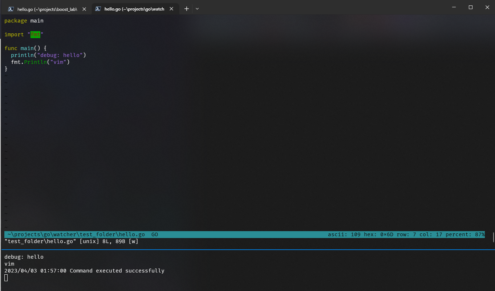
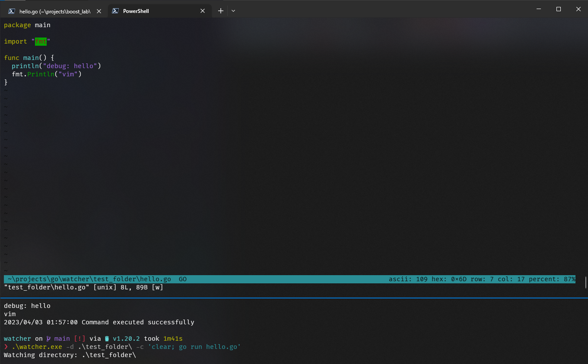

# Golang folder watcher and command runner


## The Watcher Go Lang Powershell and sh specific (so far)


I didn't have something easy to use on Windows 10. Everything wanted me
to have extra steps. What better way to practice. Just building the tool
myself.

The goal is for a windows folder watcher for my golang development.

## Table of Contents
* [Examples](#examples)
* [Project Setup](#project-setup)
* [Project Breakdown](#project-breakdown)

---

## Examples




After the program is compiled for your Operating System. You should be
able to use it like `./watcher -d /path/to/directory -c "clear; go run hello.go"`

## Project Setup

### How was the project setup from scratch?

* Setup a project folder `watcher`
* `cd watcher`
* `go mod init github.com/YOURUSERNAME/directory_watcher` - This sets up
	the module folder to allow downloads into. Without it, we cannot run
	`go get github.com/fsnotify/fsnotify`
* `go get github.com/fsnotify/fsnotify`
* `vim watcher.go` - this is where we will put the program
* `./watcher -d /path/to/directory -c "clear; go run hello.go"` - This
	is the use of the command.
	- `-d`: directory to watch
	- `-c`: commands to run

`watcher.go`:

```go
package main

import (
	"flag"
	"fmt"
	"log"
	"os"
	"os/exec"
	"path/filepath"
	"runtime"
	"sync"
	"time"

	"github.com/fsnotify/fsnotify"
)

var debounceDuration = 5000 * time.Millisecond

func debounce(execution func(), duration time.Duration) func() {
	var timer *time.Timer
	var mu sync.Mutex

	return func() {
		mu.Lock()
		defer mu.Unlock()

		if timer != nil {
			timer.Stop()
		}

		timer = time.AfterFunc(duration, execution)
	}
}

func main() {
	dirFlag := flag.String("d", ".", "Directory to watch for changes")
	cmdFlag := flag.String("c", "", "Shell command to run on file changes")
	flag.Parse()
	dirToWatch := *dirFlag
	commandToRun := *cmdFlag

	// Check if the directory exists
	if _, err := os.Stat(dirToWatch); os.IsNotExist(err) {
		log.Fatalf("Directory %s does not exist\n", dirToWatch)
	}

	// Create a new watcher
	watcher, err := fsnotify.NewWatcher()
	if err != nil {
		log.Fatal(err)
	}
	defer watcher.Close()

	// Start watching the directory
	err = watcher.Add(dirToWatch)
	if err != nil {
		log.Fatal(err)
	}

	fmt.Printf("Watching directory: %s\n", dirToWatch)

	executeCommand := func() {
		if commandToRun != "" {
			var cmd *exec.Cmd
			if runtime.GOOS == "windows" {
				cmd = exec.Command("powershell.exe", "-Command", commandToRun)
			} else {
				cmd = exec.Command("sh", "-c", commandToRun)
			}
			cmd.Dir = dirToWatch
			cmd.Stdout = os.Stdout
			cmd.Stderr = os.Stderr

			err := cmd.Run()
			if err != nil {
				log.Printf("Command execution failed: %s\n", err)
			} else {
				log.Printf("Command executed successfully\n")
			}
		}
	}

	debouncedExecuteCommand := debounce(executeCommand, debounceDuration)

	// Process file system events
	for {
		select {
		case event := <-watcher.Events:
			if event.Op&fsnotify.Write == fsnotify.Write || event.Op&fsnotify.Create == fsnotify.Create {
				relativePath, _ := filepath.Rel(dirToWatch, event.Name)
				log.Printf("File changed: %s\n", relativePath)
				debouncedExecuteCommand()
			}
		case err := <-watcher.Errors:
			log.Printf("Watcher error: %s\n", err)
		}
	}
}
```

This first section is just the import statement. What do we want to
include?

```go
package main

import (
	"flag"
	"fmt"
	"log"
	"os"
	"os/exec"
	"path/filepath"
	"runtime"
	"sync"
	"time"

	"github.com/fsnotify/fsnotify"
)
```

* `flag`: how we will digest `-c` and `-d` or any other flags we would
	like to have
* `fmt`: Standard package that provides formatted I/O operations,
	similar to C's `printf` and `scanf`.
* `log`: For logging messages. I could also use `fmt` with `println` but
	it doesn't have extra features like error handling. Log is more full
	featured on those fronts.
* `os`: Provides a platform-independent interface to operating system
	functionality
* `os/exec`: Our interface to perform executed commands on the system
* `path/filename`: This is how we will manipulate the files
* `runtime`: This is how we can interact with the runtime system.
	Garbage collection, scheduling, and other low-level components
* `sync`: Provides synchronization primitive, such as Mutexes and
	WaitGroups, for coordinating the execution of multiple
	Goroutines.These primitives help you avoid race conditions and ensure
	that your concurrent code is safe and efficient. Mutexes are used to
	protect shared resources from concurrent access
* `time`:
* `github.com/fsnotify/fsnotify`: This is the package that will watch
	the directory and alert for changes.

Now that we understand the imports at the top we can work on the
`debounce` functionality.

```go
var debounceDuration = 5000 * time.Millisecond

func debounce(execution func(), duration time.Duration) func() {
	var timer *time.Timer
	var mu sync.Mutex

	return func() {
		mu.Lock()
		defer mu.Unlock()

		if timer != nil {
			timer.Stop()
		}

		timer = time.AfterFunc(duration, execution)
	}
}
```

What is really going on in here? Let's break it down step by step.
